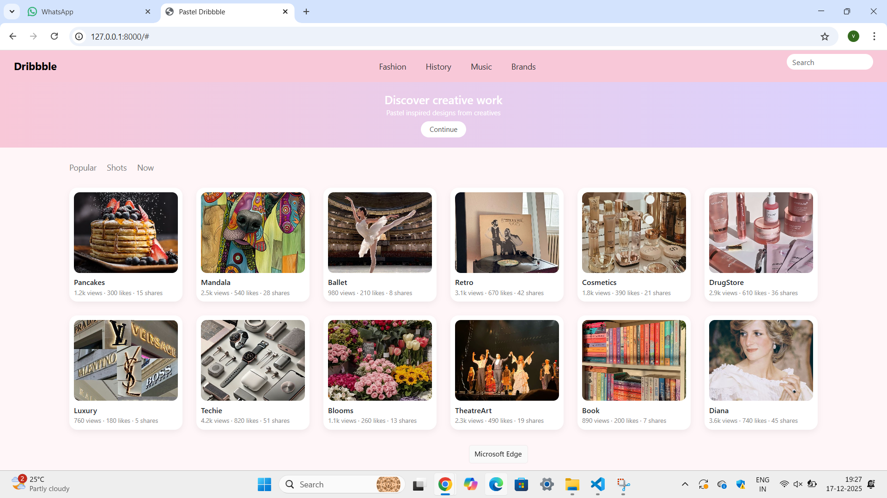

# Project Responsive Web Design using Bootstrap
# Date:
# AIM:
To create a simplified clone of Dribbble (https://dribbble.com/) landing page.

# DESIGN STEPS:
## Step 1:
Clone the repository from GitHub.

## Step 2:
Create Django Admin project.

## Step 3:
Create a New App under the Django Admin project.

## Step 4:
Insert the necessary CSS and JavaScript files as external in order to use Bootstrap.

## Step 5:
Create a HTML file and include the needed Bootstrap components.

## Step 6:
Publish the website in the LocalHost.

# PROGRAM :
proj.html
```
<html>
<head>
    <title>Pastel Dribbble</title>
    <link href="https://cdn.jsdelivr.net/npm/bootstrap@5.3.3/dist/css/bootstrap.min.css" rel="stylesheet">
    <link rel="stylesheet" href="">
</head>
<body>

<nav class="navbar navbar-expand-lg pastel-nav px-4">
    <a class="navbar-brand fw-bold" href="#">Dribbble</a>

    <ul class="navbar-nav ms-4">
        <li class="nav-item"><a class="nav-link" href="#">Fashion</a></li>
        <li class="nav-item"><a class="nav-link" href="#">History</a></li>
        <li class="nav-item"><a class="nav-link" href="#">Music</a></li>
        <li class="nav-item"><a class="nav-link" href="#">Brands</a></li>
    </ul>

    <form class="d-flex ms-auto">
        <input class="form-control pastel-search" type="search" placeholder="Search">
    </form>
</nav>

<section class="hero text-center">
    <h2>Discover creative work</h2>
    <p>Pastel inspired designs from creatives</p>
    <button class="btn pastel-btn">Continue</button>
</section>

<div class="container my-4 filter-bar">
    <span>Popular</span>
    <span>Shots</span>
    <span>Now</span>
</div>

<div class="container">
    <div class="row g-4">

        <div class="col-md-2">
            <div class="shot-card">
                
                <div class="card-info">
                    <div class="title">Pancakes</div>
                    <div class="stats">1.2k views · 300 likes · 15 shares</div>
                </div>
            </div>
        </div>

        <div class="col-md-2">
            <div class="shot-card">
                
                <div class="card-info">
                    <div class="title">Mandala</div>
                    <div class="stats">2.5k views · 540 likes · 28 shares</div>
                </div>
            </div>
        </div>

        <div class="col-md-2">
            <div class="shot-card">
                
                <div class="card-info">
                    <div class="title">Ballet</div>
                    <div class="stats">980 views · 210 likes · 8 shares</div>
                </div>
            </div>
        </div>

        <div class="col-md-2">
            <div class="shot-card">
                
                <div class="card-info">
                    <div class="title">Retro</div>
                    <div class="stats">3.1k views · 670 likes · 42 shares</div>
                </div>
            </div>
        </div>

        <div class="col-md-2">
            <div class="shot-card">
                
                <div class="card-info">
                    <div class="title">Cosmetics</div>
                    <div class="stats">1.8k views · 390 likes · 21 shares</div>
                </div>
            </div>
        </div>

        <div class="col-md-2">
            <div class="shot-card">
                
                <div class="card-info">
                    <div class="title">DrugStore</div>
                    <div class="stats">2.9k views · 610 likes · 36 shares</div>
                </div>
            </div>
        </div>

        <div class="col-md-2">
            <div class="shot-card">
                
                <div class="card-info">
                    <div class="title">Luxury</div>
                    <div class="stats">760 views · 180 likes · 5 shares</div>
                </div>
            </div>
        </div>

        <div class="col-md-2">
            <div class="shot-card">
                
                <div class="card-info">
                    <div class="title">Techie</div>
                    <div class="stats">4.2k views · 820 likes · 51 shares</div>
                </div>
            </div>
        </div>

        <div class="col-md-2">
            <div class="shot-card">
                
                <div class="card-info">
                    <div class="title">Blooms</div>
                    <div class="stats">1.1k views · 260 likes · 13 shares</div>
                </div>
            </div>
        </div>

        <div class="col-md-2">
            <div class="shot-card">
                
                <div class="card-info">
                    <div class="title">TheatreArt</div>
                    <div class="stats">2.3k views · 490 likes · 19 shares</div>
                </div>
            </div>
        </div>

        <div class="col-md-2">
            <div class="shot-card">
                
                <div class="card-info">
                    <div class="title">Book</div>
                    <div class="stats">890 views · 200 likes · 7 shares</div>
                </div>
            </div>
        </div>

        <div class="col-md-2">
            <div class="shot-card">
                
                <div class="card-info">
                    <div class="title">Diana</div>
                    <div class="stats">3.6k views · 740 likes · 45 shares</div>
                </div>
            </div>
        </div>

    </div>
</div>

<script src="https://cdn.jsdelivr.net/npm/bootstrap@5.3.3/dist/js/bootstrap.bundle.min.js"></script>
</body>
</html>
```
pro.css
```
body {
    margin: 0;
    background-color: #fff6f8;
    font-family: "Segoe UI", sans-serif;
}

.pastel-nav {
    background-color: #f8c8d8;
    padding: 6px 24px;
}

.navbar {
    display: flex;
    align-items: center;
    position: relative;
}

.navbar-brand {
    font-size: 18px;
    z-index: 1;
}

.navbar-nav {
    position: absolute;
    left: 50%;
    transform: translateX(-50%);
    display: flex;
    gap: 18px;
}

.nav-link {
    font-size: 14px;
    color: #333;
    padding: 4px 6px;
}

.navbar form {
    margin-left: auto;
}

.pastel-search {
    width: 150px;
    border-radius: 16px;
    border: none;
    padding: 4px 10px;
    font-size: 13px;
}

.hero {
    background: linear-gradient(90deg, #f8c8d8, #d9d2ff);
    padding: 18px 0;
    text-align: center;
    color: white;
}

.hero h2 {
    font-size: 20px;
    margin-bottom: 2px;
}

.hero p {
    font-size: 12px;
    margin-bottom: 6px;
}

.pastel-btn {
    background-color: white;
    color: #555;
    border-radius: 16px;
    padding: 4px 14px;
    font-size: 12px;
}

.filter-bar {
    display: flex;
    gap: 18px;
    font-size: 14px;
    color: #777;
}

.col-md-3 {
    width: 16.66%;
}

.shot-card {
    background: white;
    border-radius: 14px;
    padding: 8px;
    box-shadow: 0 4px 10px rgba(0,0,0,0.06);
}

.shot-card img {
    width: 100%;
    height: 140px;
    object-fit: cover;
    border-radius: 10px;
}

.card-info {
    margin-top: 6px;
}

.title {
    font-size: 13px;
    font-weight: 600;
}

.stats {
    font-size: 11px;
    color: #888;
}
```
urls.py
```
from django.contrib import admin
from django.urls import path
from myapp import views

urlpatterns = [
    path('admin/', admin.site.urls),
    path('',views.pro)
]
```
views.py
```
from django.shortcuts import render
def pro(request):
    return render(request,'proj.html')
```


# OUTPUT:



# RESULT:
The Project for responsive web design using Bootstrap is completed successfully.
